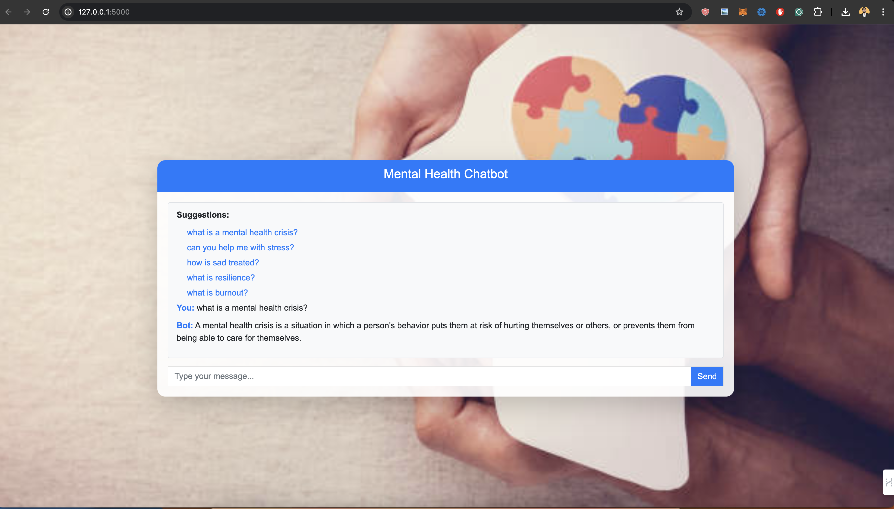

# Mental Health Chatbot

Welcome to the Mental Health Chatbot repository. This project is a simple, yet effective mental health chatbot designed to assist users with common mental health concerns. The chatbot uses predefined responses and is built with Python, Flask, and Bootstrap for a clean, responsive UI.



## Features

- Provides predefined responses to common mental health queries.
- Smooth, responsive design using Bootstrap.
- Displays typing indicator and clickable suggestions for user input.
- Easily customizable and extensible.

## Demo

You can try out the chatbot by cloning this repository and running it locally. Follow the instructions below to get started.

## Installation

### Prerequisites

- Python 3.6 or higher
- pip (Python package installer)
- Virtual environment (optional but recommended)

### Steps

1. **Clone the repository:**

    ```sh
    git clone https://github.com/your-username/mental-health-chatbot.git
    cd mental-health-chatbot
    ```

2. **Create and activate a virtual environment (optional but recommended):**

    ```sh
    python -m venv venv
    source venv/bin/activate  # On Windows, use `venv\Scripts\activate`
    ```

3. **Install the required packages:**

    ```sh
    pip install -r requirements.txt
    ```

4. **Run the application:**

    ```sh
    python app.py
    ```

5. **Open your web browser and go to:**

    ```
    http://127.0.0.1:5000
    ```

## Usage

Interact with the chatbot by typing your messages in the input box and pressing "Send". The chatbot will respond with predefined messages based on the input.

## Customization

### Adding New Responses

1. Open the `static/responses.json` file.
2. Add your new question-response pairs in the following format:

    ```json
    {
        "your new question": "your new response"
    }
    ```

### Updating the UI

- Modify the HTML in the `templates/index.html` file.
- Update the CSS styles in the `static/styles.css` file.
- Enhance the JavaScript functionality in the `static/scripts.js` file.

## Contact

If you want a custom chatbot developed, feel free to contact me at: [cwtausif@gmail.com](mailto:cwtausif@gmail.com).

## License

This project is licensed under the MIT License. See the [LICENSE](LICENSE) file for more details.

## Acknowledgements

- [Flask](https://flask.palletsprojects.com/)
- [Bootstrap](https://getbootstrap.com/)
- [Unsplash](https://unsplash.com/) for the background image

## Contributing

Contributions are welcome! Please open an issue or submit a pull request for any improvements or additions.

---

Thank you for checking out the Mental Health Chatbot project. We hope it provides a helpful resource for mental health support.
